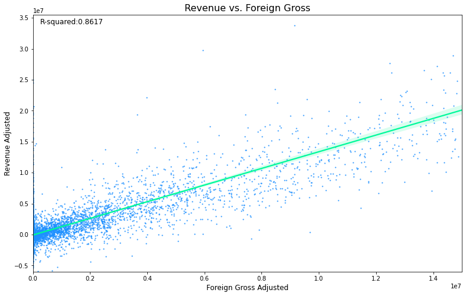
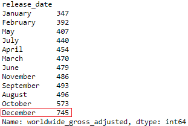
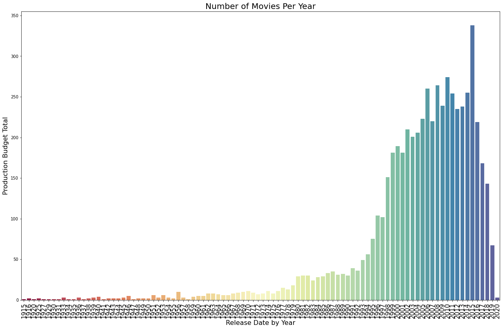

Notebook 1 : https://bit.ly/3bUi2yq  
Notebook 2 : https://bit.ly/2RhyRtk  

PDF of the slides : https://bit.ly/2DRFAqU
PDF of the slides : https://bit.ly/2FmRauX

### Question 1 : Is there a correlation between the revenue of a movie and it's budget?¶
The r-squared between revenue and production budget is only 0.2275, meaning that only 22.75% of the dependent variable variation is explained by the linear model.

The density plot returns a Pearson correlation coefficient of 0.48, showing that the revenue of a movie and it's budget are correlated. However, the correlation is only moderately positive. The two variables are not strongly correlated.

### Question 2 : Do movies generate more revenue domestically or abroad?
On an absolute basis, the largest portion of a movie's revenue is it's domestic sales. The r-squared between the two variables is 0.839, showing a strong linear relationship. Furthermore, the pearson's r is 0.92, which also shows a strong correlation.

On average, domestic gross comprises 61.9% of a movie's total gross, while foreign sales only make up about 38.1%

While foreign gross has a stronger correlation with revenue, this is likely due to it's smaller variation.

Ideally movie-making companies should focus their advertising campaigns primarily on the domestic market, as it represents, on average, a greater portion of potential revenue.

### Question 3 : Does the release month of a movie affect its revenue?¶
At face value, the best months to release a film in were:

1. December
2. June
3. May

However, December had far more films released than any other month. We decided a better metric to gauge the best month to release a film in would be the average revenue of films in that month as opposed to the total.

Under that assumption, the best months to release films in were:

1. May
2. June
3. July

### Question 4 : Which years had the highest grossing films? 

By total value, the 90's, 2010's, and 2020's were the decades with the highest grossing films.

However, in some of the earlier decades examined, there may have been fewer than 10 films released a year.

Upon further examination, we found that the highest average grossing years were:

1. 1937 (Snow White and the Seven Dwarves)
2. 1940 (Pinocchio and Fantasia)
3. 1942 (Bambi)

